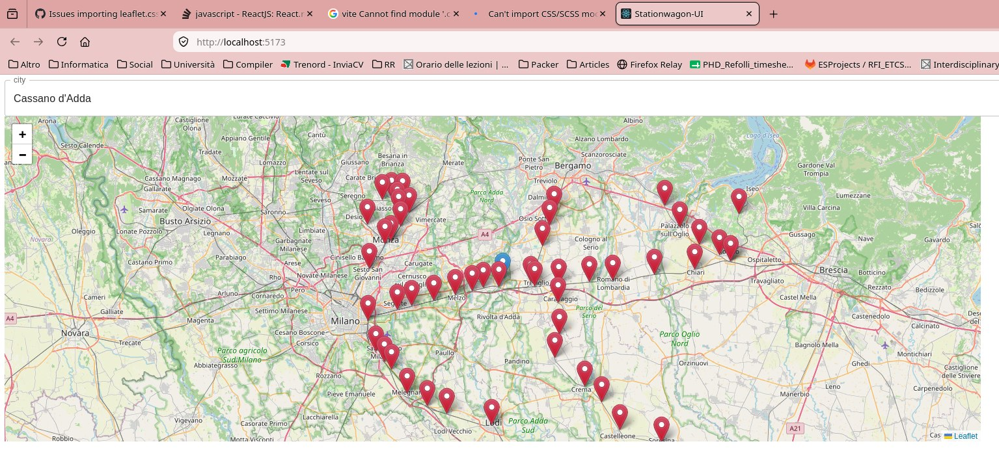

# Getting Started with Stationwagon

Preview in [The Glorious Pages](https://frefolli.github.io/stationwagon-ui/)

## Download and Run Stationwagon frontend UI

```
git clone git@github.com:frefolli/stationwagon-ui
cd stationwagon-ui
yarn
```

## Optionally Grab the Updated Data from the Main Repo

```
git clone git@github.com:frefolli/stationwagon
cd stationwagon
make stations.json cities.json
cp cities.json stations.json ../stationwagon-ui/src/data
```

## Enjoy

```
yarn dev
```

## Preview


